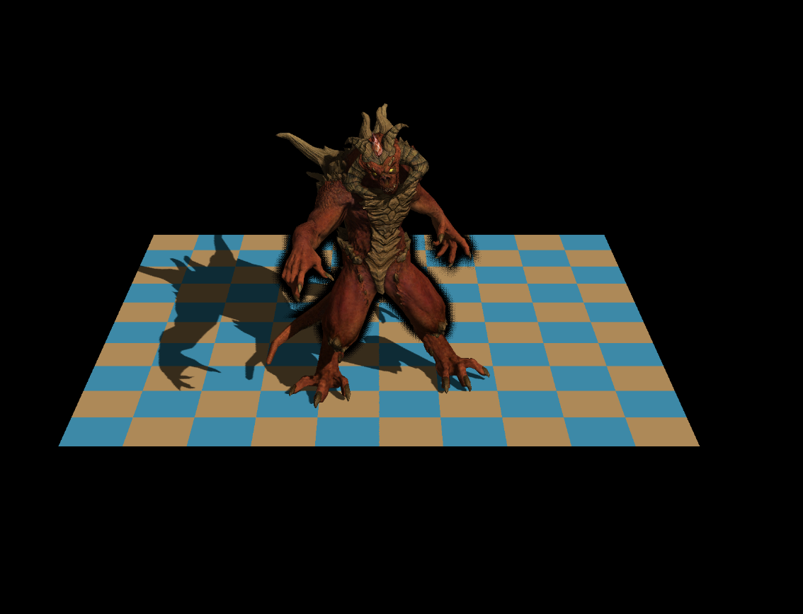
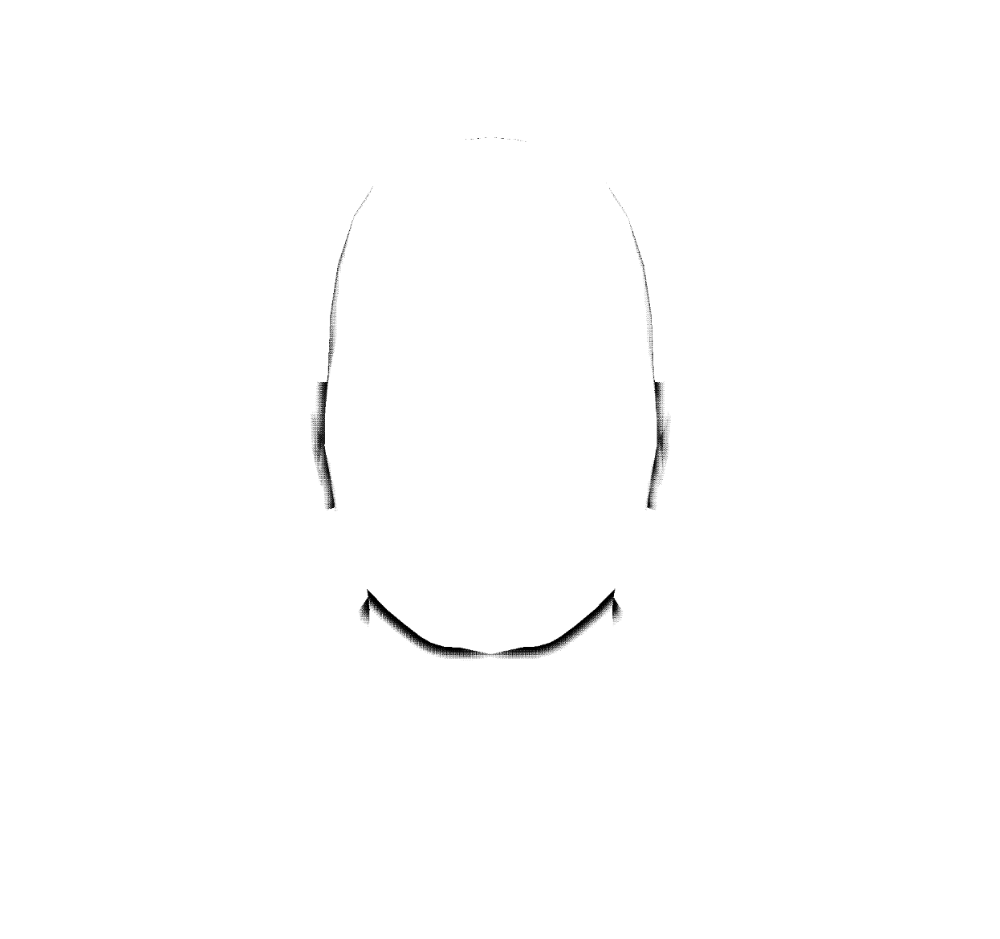
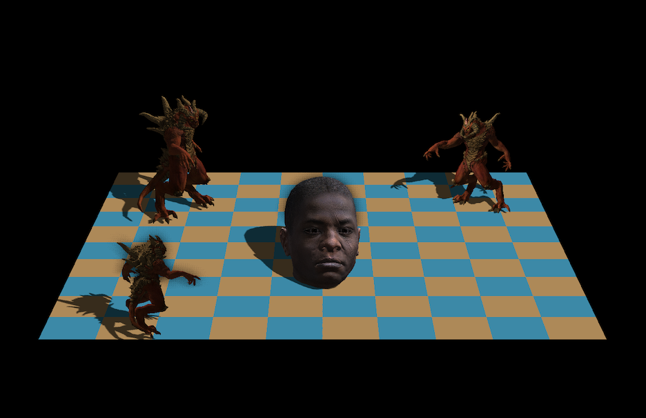

# 🎨 Multi-Threaded Software Renderer
> **A high-performance CPU pipeline built from scratch in C++17**


This renderer is a deep dive into the **Graphics Pipeline**, **Linear Algebra**, and **Systems Programming**. Inspired by the *Tiny Renderer* curriculum, it moves beyond the basics by implementing a fully multi-threaded architecture with lock-free synchronization.

---

### 🚀 Performance Engineering
* **Tile-Based Parallelism**: The screen is divided into 16x16 tiles, utilizing a **Thread Pool** to maximize cache locality and CPU saturation.
* **Lock-Free Z-Buffer**: Used `std::atomic` to handle concurrent pixel writes, eliminating Mutex contention and boosting FPS significantly.
* **Atomic Task Scheduling**: Efficient load balancing via `fetch_add` on an atomic counter, ensuring no CPU core stays idle.

### 📐 The Math Engine
* **Column-Major Matrices**: Stored in column-major order to align with standard graphics API conventions (OpenGL/DirectX).
* **Template-Based Vectors**: Generic N-dimensional vectors with `static_assert` and **C++ Concepts** for rigorous compile-time type safety.
* **Perspective-Correct Shading**: Advanced barycentric interpolation accounting for the $1/w$ depth component.

### 🛠 Graphics Features
* **Advanced Lighting**: Full Blinn-Phong model with Normal & Specular mapping.
* **Soft Shadows**: Shadow mapping with **3x3 PCF (Percentage Closer Filtering)** for realistic edges.
* **Ambient Occlusion**: An optimized **SSAO** pass to simulate global soft shadows.
* **Raw Binary I/O**: Custom **TGA encoder** for direct image generation without external dependencies.

---

## 📸 Rendering Showcase

| Normal Mapping | Shadow Mapping (PCF) | SSAO Pass | Final Scene |
| :---: | :---: | :---: | :---: |
|  |  |  |  |
| *Fine surface details via Tangent-space normals* | *Soft shadows using 3x3 PCF kernel* | *Ambient occlusion pass on depth buffer* | *All effects combined: Lighting, Shadows & SSAO* |

---

### 🏗 How to Build
```bash
mkdir build && cd build
cmake ..
make
./Renderer
