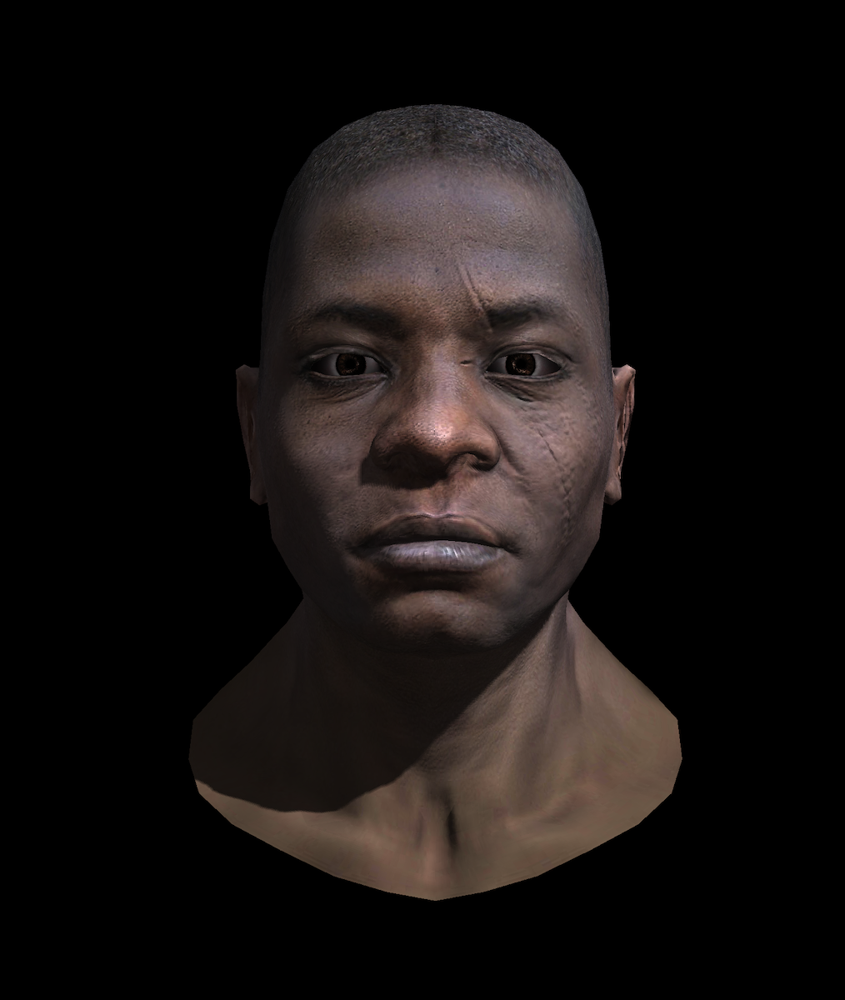

# ⚙️ Multi-Threaded Software Renderer
> **A high-performance CPU pipeline built from scratch in C++20**


This renderer is a deep dive into the **Graphics Pipeline**, **Linear Algebra**, and **Systems Programming**. Inspired by the *Tiny Renderer* curriculum, it moves beyond the basics by implementing a fully multi-threaded architecture, zero-copy memory management, and advanced shading techniques.

---

### 🚀 Performance & Systems Engineering
* **Tile-Based Parallelism**: The screen is divided into 32x32 tiles. A custom lock-free **Thread Pool** dynamically assigns workers to tiles, maximizing CPU saturation.
* **Atomic Task Scheduling**: Efficient load balancing via `fetch_add` on an `std::atomic` counter for tile processing, ensuring no CPU core stays idle without heavy Mutex contention.
* **Zero-Copy Memory Management (RAII)**: Heavy buffers (Framebuffer, Z-Buffer, Normal/Shadow Maps) are encapsulated in a single RAII structure. Memory is allocated *once* at startup and simply cleared between passes, eliminating dynamic allocations inside the hot loop.
* **Screen-Space Backface Culling**: Mathematically eliminates hidden geometry using 2D cross-product calculations before the expensive rasterization phase.

### 🧮 The Math Engine
* **Generic Template Library**: Built custom `Vec<T, n>` and `Matrix<T, M, N>` structures utilizing **C++20 Concepts** (`requires std::is_arithmetic_v<T>`) for rigorous compile-time type safety.
* **Column-Major Matrices**: Aligned with standard graphics API conventions (OpenGL/DirectX).
* **Perspective-Correct Shading**: Advanced barycentric interpolation accounting for the $1/w$ depth component.

### 🎨 Graphics Features
* **Advanced Lighting**: Full Blinn-Phong model with Normal & Specular mapping.
* **Soft Shadows**: Shadow mapping with a **3x3 PCF (Percentage Closer Filtering)** kernel for realistic edges.
* **Ambient Occlusion**: An optimized **SSAO** pass to simulate global soft shadows, refactored into pure mathematical functions for strict SRP adherence.
* **Raw Binary I/O**: Custom **TGA encoder** for direct image generation without external dependencies.

---

## 🖼️ Rendering Showcase

| Normal Mapping | Shadow Mapping (PCF) | SSAO Pass | Final Scene |
| :---: | :---: | :---: | :---: |
|  |  |  |  |
| *Fine surface details via Tangent-space normals* | *Soft shadows using 3x3 PCF kernel* | *Ambient occlusion pass on depth buffer* | *All effects combined: Lighting, Shadows & SSAO* |

---

### 🛠️ How to Build
```bash
git clone [https://github.com/YourUsername/YourRepoName.git](https://github.com/YourUsername/YourRepoName.git)
cd YourRepoName
mkdir build && cd build
cmake ..
make
./Renderer