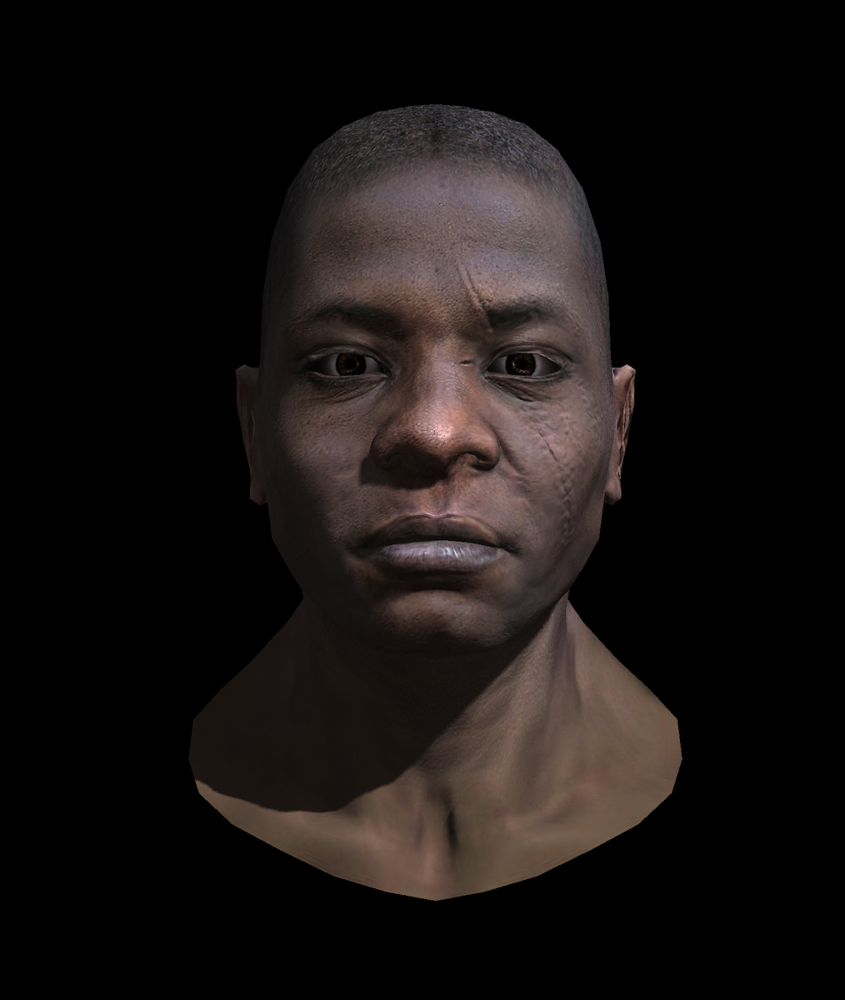
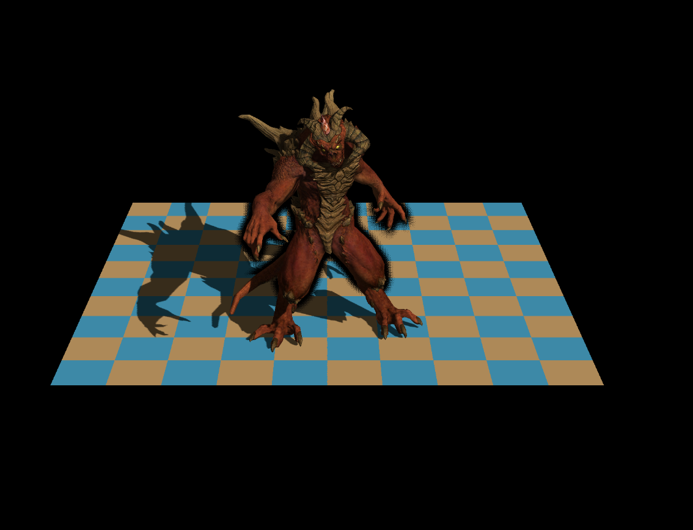
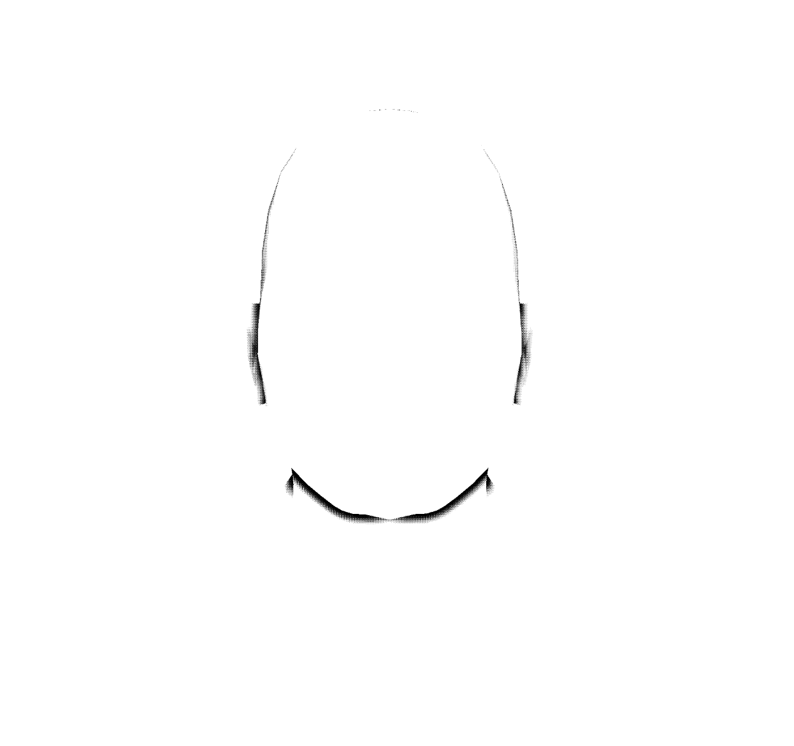
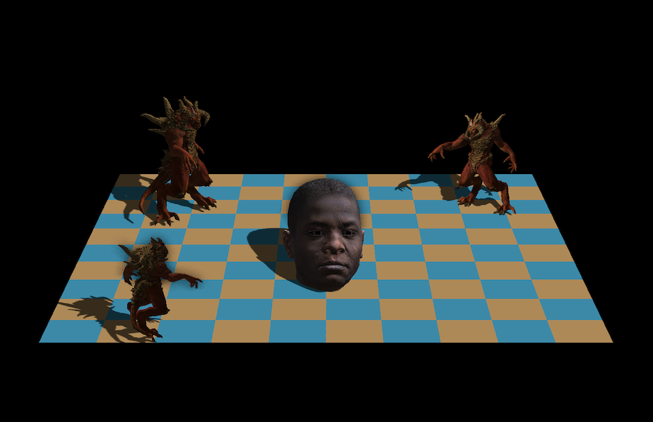
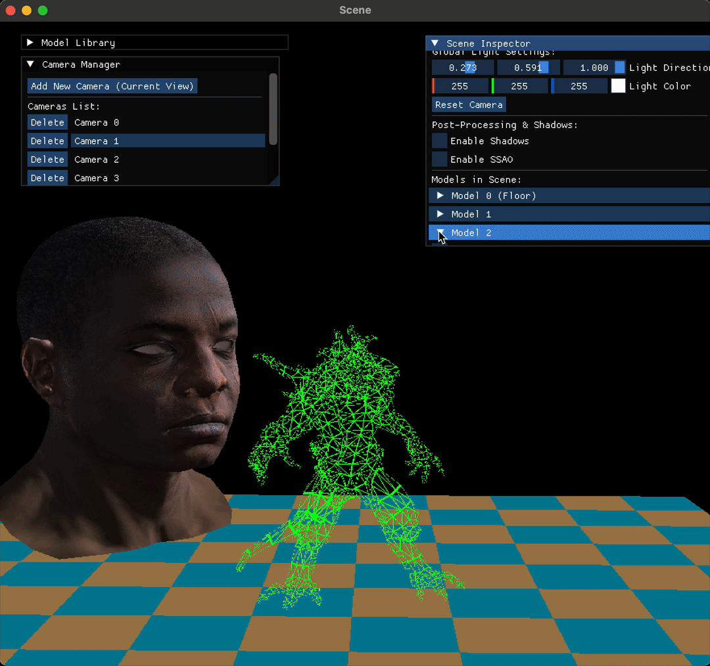

# ⚙️ Multi-Threaded Software Renderer
> **A high-performance CPU pipeline built from scratch in C++20**


This renderer is a deep dive into the **Graphics Pipeline**, **Linear Algebra**, and **Systems Programming**. Inspired by the *Tiny Renderer* curriculum, it moves beyond the basics by implementing a fully multi-threaded architecture, zero-copy memory management, and advanced shading techniques.
* **Note that the updated version is Real-Time. The offline version is under the 'legacy/offline-tga' branch.**

---

### 🚀 Systems Engineering
* **Tile-Based Parallelism**: The screen is divided into 32x32 tiles. A custom **Thread Pool** dynamically assigns workers to tiles, maximizing CPU saturation.
* **Thread-Safe Task Queue**: Implementation of a synchronized worker pool using std::condition_variable and std::mutex. Tasks are distributed dynamically to ensure no CPU core remains idle during complex frame calculations.
* **Atomic Work Tracking**: Uses std::atomic for thread-safe tracking of active tasks and frame completion, facilitating non-blocking synchronization in the waitFinished routine.
* **Zero-Copy Memory Management (RAII)**: Heavy buffers (Framebuffer, Z-Buffer, Normal/Shadow Maps) are encapsulated in a single RAII structure. Memory is allocated *once* at startup and simply cleared between passes, eliminating dynamic allocations inside the hot loop.
* **Screen-Space Backface Culling**: Mathematically eliminates hidden geometry using 2D cross-product calculations before the expensive rasterization phase.

### 🚀 Performance Benchmark
* **Throughput**: Processes ~75,000 triangles per frame.
* **Framerate**: Sustains 50 FPS at 800x800 resolution (~75k triangles/frame)
* **Hardware**: Benchmarked on Apple M1.
* **Architecture**: 100% CPU-bound pipeline. The GPU is utilized solely as a "dumb" display buffer via OpenGL textures, ensuring the entire rasterization logic is software-based.
* **Note: The GPU acts only as a display buffer. All geometric calculations and pixel-level shading are computed in software on the CPU to ensure full control over the pipeline.**
### 🧮 The Math Engine
Generic Template Library: Custom Vec<T, n> and Matrix<T, M, N> structures utilizing C++ Templates for compile-time arithmetic validation.
* **Column-Major Matrices**: Aligned with standard graphics API conventions (OpenGL/DirectX).
* **Perspective-Correct Shading**: Advanced barycentric interpolation accounting for the $1/w$ depth component.

### 🎨 Graphics Features
* **Advanced Lighting**: Full Blinn-Phong model with Normal & Specular mapping.
* **Soft Shadows**: Shadow mapping with a **3x3 PCF (Percentage Closer Filtering)** kernel for realistic edges.
* **Ambient Occlusion**: An optimized **SSAO** pass to simulate global soft shadows, refactored into pure mathematical functions for strict SRP adherence.
* **Raw Binary I/O**: Custom **TGA encoder** for direct image generation without external dependencies.

---

## 🖼️ Rendering Showcase

| Normal Mapping | Shadow Mapping (PCF) | SSAO Pass | Final Scene |
| :---: | :---: | :---: | :---: |
|  |  |  |  |
| *Fine surface details via Tangent-space normals* | *Soft shadows using 3x3 PCF kernel* | *Ambient occlusion pass on depth buffer* | *All effects combined: Lighting, Shadows & SSAO* |
---

<p align="center">
  
</p>

### 🛠️ How to Build
```bash
git clone https://github.com/meitarBass/myRenderer
cd YourRepoName
mkdir build && cd build
cmake ..
make
./Renderer
