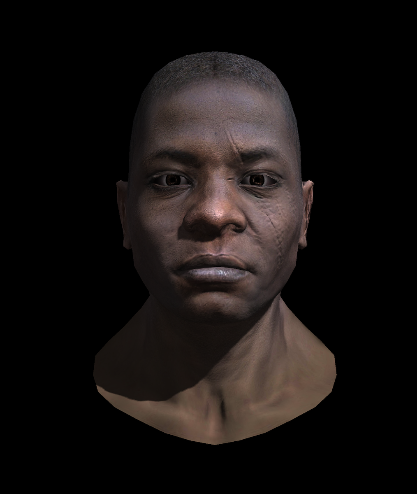
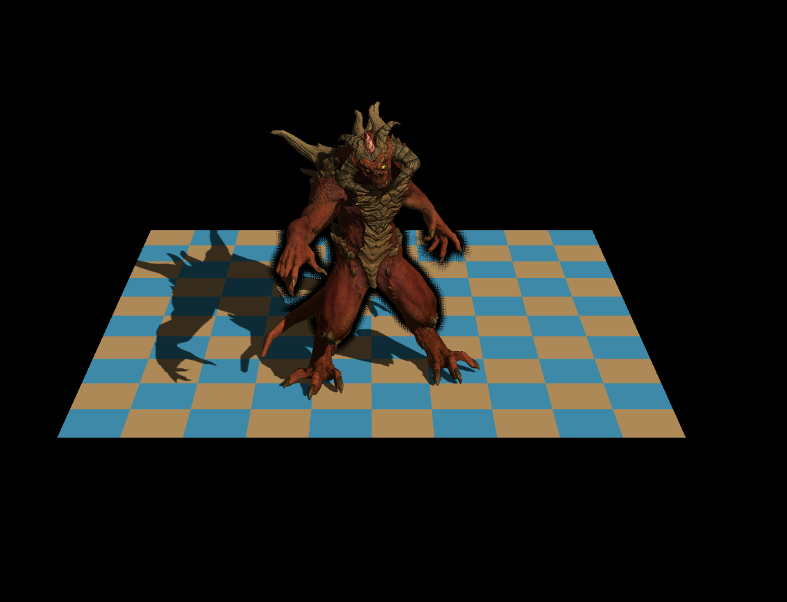
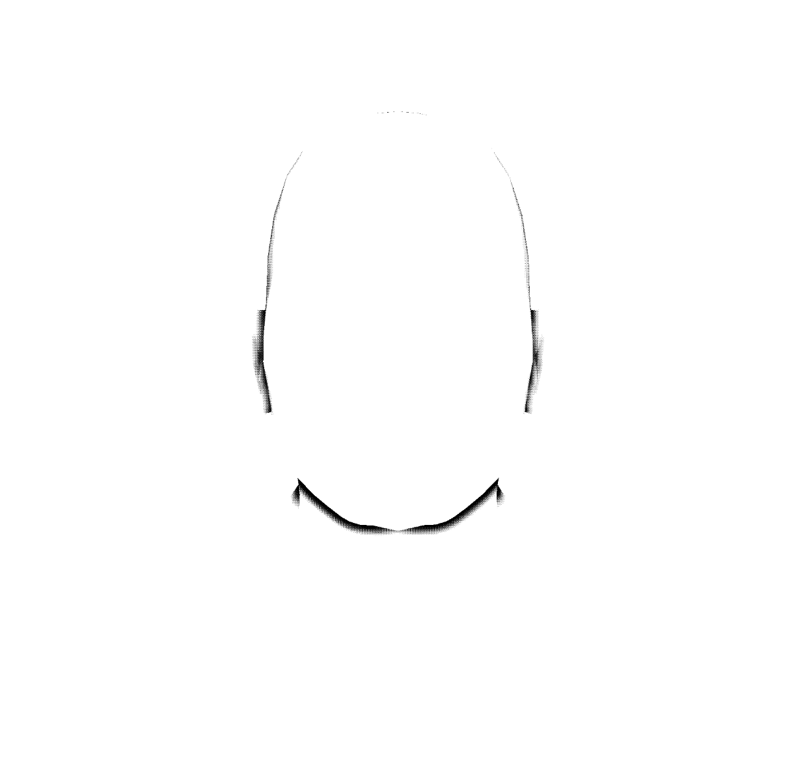
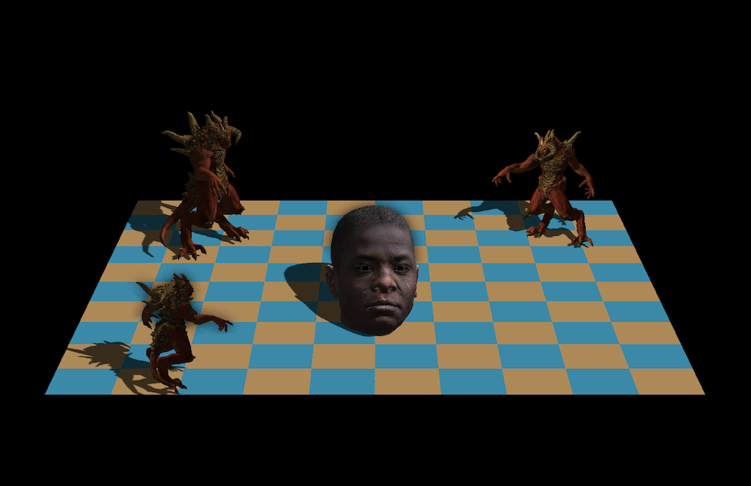
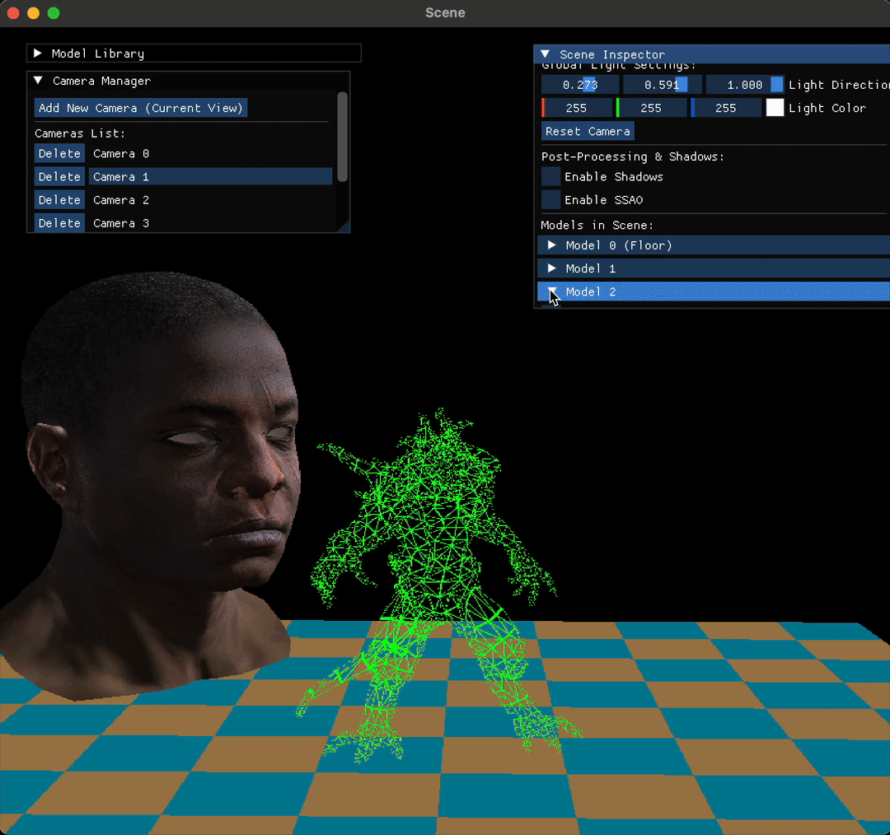

# ⚙️ Multi-Threaded Software Renderer
> **A real-time renderer built from scratch in C++20: a multi-threaded CPU rasterizer plus an OpenGL hardware path**


This renderer is a deep dive into the **Graphics Pipeline**, **Linear Algebra**, and **Systems Programming**. Inspired by the *Tiny Renderer* curriculum, it started as a fully software-based CPU pipeline (multi-threaded, zero-copy memory management, shadows and SSAO) and has grown into an interactive scene editor with a second, GPU-based render path for comparison.

* **Two render paths, switchable at runtime**: the **CPU software rasterizer** (every vertex and pixel computed on the CPU) and an **OpenGL path** with GLSL shaders, toggled from the Scene Inspector.
* **Note:** the original offline (TGA output) version is kept in the git history before the real-time rewrite.

---

### 🚀 Systems Engineering
* **Tile-Based Parallelism**: The screen is divided into 32x32 tiles. A custom **Thread Pool** dynamically assigns workers to tiles, maximizing CPU saturation.
* **Thread-Safe Task Queue**: Implementation of a synchronized worker pool using `std::condition_variable` and `std::mutex`. Tasks are distributed dynamically to ensure no CPU core remains idle during complex frame calculations.
* **Atomic Work Tracking**: Uses `std::atomic` for thread-safe tracking of active tasks and frame completion, facilitating non-blocking synchronization in the `waitFinished` routine.
* **Zero-Copy Memory Management (RAII)**: Heavy buffers (Framebuffer, Z-Buffer, Normal/Shadow Maps) are encapsulated in a single RAII structure. Memory is allocated *once* at startup and simply cleared between passes, eliminating dynamic allocations inside the hot loop.
* **Screen-Space Backface Culling**: Mathematically eliminates hidden geometry using 2D cross-product calculations before the expensive rasterization phase.
* **View-Frustum Culling**: Models whose bounding box is entirely off screen are skipped before drawing, with the rendered/culled counts shown live in the UI.
* **BVH-Accelerated Picking**: Mouse picking builds a bounding-volume hierarchy over the models' world-space boxes and finds the closest hit with a pruned traversal.

### 🚀 Performance Benchmark
* **Throughput**: Processes ~75,000 triangles per frame.
* **Framerate**: Sustains 50 FPS at 800x800 resolution (~75k triangles/frame).
* **Hardware**: Benchmarked on Apple M1.
* **Scope**: These figures were measured on the original CPU pipeline. In the CPU path all geometric calculations and pixel-level shading run in software, and the GPU is used only to display the finished frame. Newer CPU-path effects (bloom, depth of field, supersampling, transparency) add cost on top.

### 🧮 The Math Engine
Generic Template Library: Custom `Vec<T, n>` and `Matrix<T, M, N>` structures utilizing C++ Templates for compile-time arithmetic validation.
* **Column-Major Matrices**: Aligned with standard graphics API conventions (OpenGL/DirectX).
* **Perspective-Correct Shading**: Advanced barycentric interpolation accounting for the $1/w$ depth component.
* **Perspective and Orthographic cameras**: field-of-view and orthographic projection modes, multiple cameras, focus/zoom/dolly controls.

### 🎨 Graphics Features

**CPU software path**
* **Advanced Lighting**: Phong model with Normal & Specular mapping, multiple lights (directional and point), flat/Gouraud/Phong shading modes, and a per-model material system (including non-uniform materials).
* **Soft Shadows**: Shadow mapping with a **3x3 PCF (Percentage Closer Filtering)** kernel for realistic edges.
* **Ambient Occlusion**: An optimized **SSAO** pass to simulate global soft shadows, refactored into pure mathematical functions for strict SRP adherence.
* **Transparency**: Per-model alpha blending with back-to-front ordering and opacity-aware shadows.
* **Post-processing**: distance fog, gaussian full-screen blur, bloom, gradient skybox, depth of field, and 2x supersampling anti-aliasing.
* **Raw Binary I/O**: Custom **TGA encoder** for direct image generation without external dependencies.

**OpenGL path**
* GLSL Phong shaders with VBO/VAO rendering.
* Planar and spherical UV generation, tangent-space normal mapping.
* Reflection and refraction environment mapping.
* Toon shading, silhouette outlines, color animation and vertex animation.
* Procedural **marble** and **wood** textures generated from object-space position with a turbulence function.

### 🖱️ Interactive Scene Editor
* Dear ImGui **Scene Inspector** with per-model transform, material and effect controls (controls are shown only for the active render path).
* Click a model to select it; hold **R** to rotate, **M** to move and **N** to scale the selected model by dragging; **W/A/S/D** to move the camera.
* Spawn primitives (cube, pyramid, tetrahedron) and load models from a folder.
* **Scene save/load** to JSON (models, cameras, lights, and render settings).

---

## 🖼️ Rendering Showcase

| Normal Mapping | Shadow Mapping (PCF) | SSAO Pass | Final Scene |
| :---: | :---: | :---: | :---: |
|  |  |  |  |
| *Fine surface details via Tangent-space normals* | *Soft shadows using 3x3 PCF kernel* | *Ambient occlusion pass on depth buffer* | *All effects combined: Lighting, Shadows & SSAO* |

---

<p align="center">
  
</p>

### 🛠️ How to Build

The project currently targets **macOS** (it links the OpenGL, Cocoa, IOKit and CoreVideo frameworks) and needs **CMake 3.21+**, a C++20 compiler, and **GLFW 3.4+**.

```bash
brew install cmake glfw
git clone https://github.com/meitarBass/myRenderer
cd myRenderer
mkdir build && cd build
cmake ..
make
./Renderer
```

Model assets are expected under `Models/obj/` (OBJ files with diffuse, normal and specular TGA maps). The build copies the `Models` folder next to the executable, and the app loads them from `../Models/obj/`, so run it from the `build` directory.
